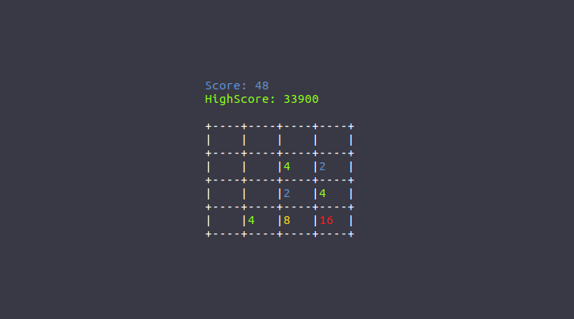
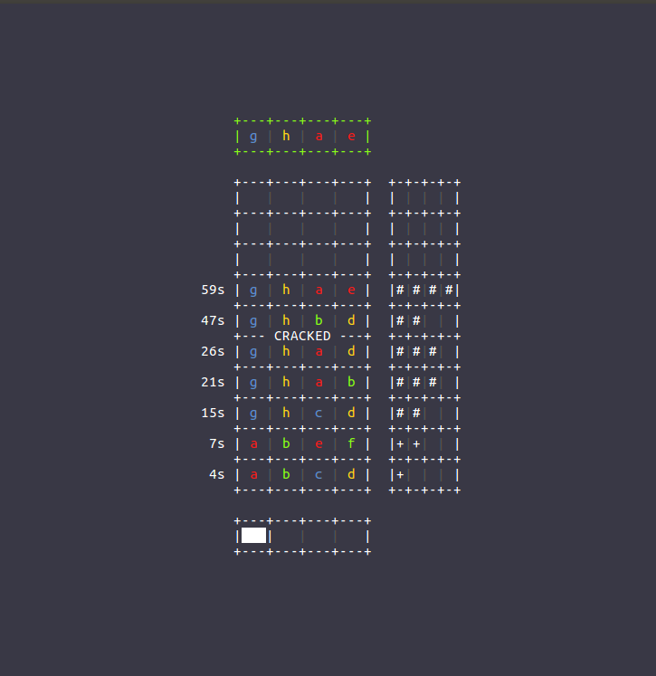

# cxxg

A set of C++ console games for Unix systems together with a small library for accessing and modifiying the terminal screen.

List of games:
  - 2048:
    
  - MasterMind:
    

# Build
In order to build `cxxg` you need `cmake (version >= 3.5)` and optionally if you want to build the unit-tests `google-test (version >= 1.8)`. 

1. Install `cmake`:
    ```
    sudo apt install cmake # Ubuntu
    brew install cmake # Mac OS (brew)
    ```
2. (Optional) Install `google-test`:
    ```
    wget https://github.com/google/googletest/archive/release-1.8.0.tar.gz
    tar -xzf release-1.8.0.tar.gz && cd googletest-release-1.8.0
    mkdir build && cd build
    cmake .. -DCMAKE_INSTALL_PREFIX=install -DCMAKE_CXX_STANDARD=11
    make && make install
    export GTEST_ROOT=`pwd`/install
    export GMOCK_ROOT=$GTEST_ROOT
    ```

3. Configure and build `cxxg`, default `BUILD_TESTS=OFF`:
    ```
    cd cxxg;
    mkdir build && cd build;
    cmake ../ -DBUILD_TESTS=[ON/OFF]
    make
    ```
